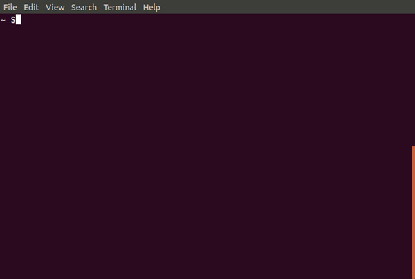
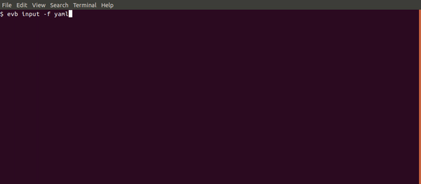

# evb-cli
Pattern generator for CloudWatch Events / EventBridge

## Installation 
Unless using AWS Single Sign-On, make sure you have your `AWS_REGION` environment variable set. Alternatively set `AWS_SDK_LOAD_CONFIG` to a truthy value.

`npm install -g @mhlabs/evb-cli`

## Usage

### To generate an EventBridge pattern:
`evb pattern` - Will prompt you with a wizard that helps you build pattern for event matching. This is using EventBridge's schema registry (currently in preview) to let you navigate the schema you want to react on. 

`evb pattern --format <yaml|json>` - Output format. Default is `json`

For AWS events, such as `aws.codepipeline` it's already enabled, but for custom events you will have to enable it in the AWS Management Console.



### To generate an EventBridge InputTransformer object:
[Input transformers](https://docs.aws.amazon.com/eventbridge/latest/userguide/eventbridge-input-transformer-tutorial.html) are useful when you only want a small portion of the event sent to your target. this command helps you navigate the JSON payload and generate the [InputTransformer CloudFormation object](https://docs.aws.amazon.com/AWSCloudFormation/latest/UserGuide/aws-properties-events-rule-inputtransformer.html)

`evb input` - Will prompt you with a wizard that helps you build the InputTransformer object. This is using EventBridge's schema registry (currently in preview).

`evb input --format <yaml|json>` - Output format. Default is `json`



## AWS SSO authentication

To set up [AWS Single Sign-On](https://aws.amazon.com/single-sign-on/) auth you'll need to configure the following parameters:

```
evb configure-sso --account-id 123456789012 --start-url https://<your-sso-url>.awsapps.com/start --region <your-region> --role <your-sso-role>
```

The role used should be allowed to perform `schemas:ListSchemas` and `schemas:DescribeSchemas`