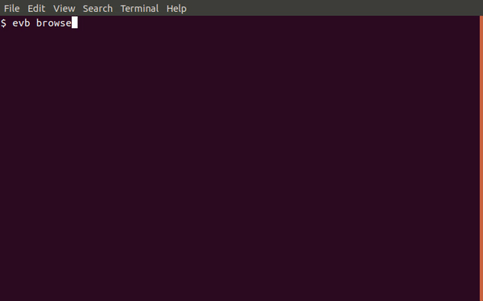
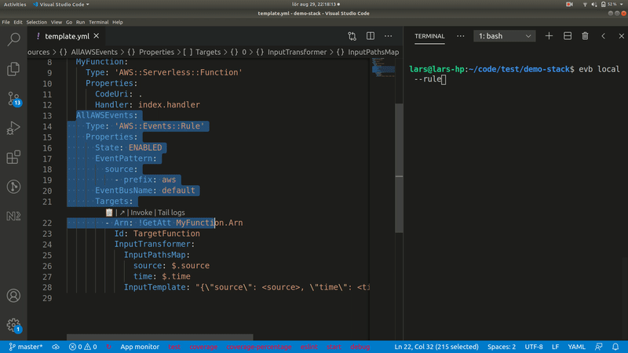

# evb-cli
Pattern generator and debugging tool for EventBridge

## Installation
`npm install -g @mhlabs/evb-cli`

## Usage

### To generate an EventBridge pattern:
`evb pattern` - Will prompt you with a wizard that helps you build pattern for event matching. This is using EventBridge's schema registry (currently in preview) to let you navigate the schema you want to react on. 

`evb pattern --format <yaml|json>` - Output format. Default is `json`

For AWS events, such as `aws.codepipeline` it's already enabled, but for custom events you will have to enable it in the AWS Management Console.


### To generate an EventBridge InputTransformer object:
[Input transformers](https://docs.aws.amazon.com/eventbridge/latest/userguide/eventbridge-input-transformer-tutorial.html) are useful when you only want a small portion of the event sent to your target. This command helps you navigate the JSON payload and generate the [InputTransformer CloudFormation object](https://docs.aws.amazon.com/AWSCloudFormation/latest/UserGuide/aws-properties-events-rule-inputtransformer.html)

`evb input` will prompt you with a wizard that helps you build the InputTransformer object. This is using EventBridge's schema registry (currently in preview).

`evb input --format <yaml|json>` - Output format. Default is `json`


### To browse targets of events:
Select a schema from the schema registry and list its targets. Select a target to browse details such as ARN, event pattern, input transformation, etc.

`evb browse` will let you browse your schemas and get insights into the targets listening to the source/detail-type combination of your event. This only works with explicit maching on `source` and `detail-type`.



### To generate an interactive diagram over the event rules of an eventbus
```
Usage: evb diagram|d [options]

Builds an interactive diagram over an eventbus' rules 

Options:
  -b, --eventbus [eventbus]  Eventbus to create diagram for (default: "default")
  -p, --profile [profile]    AWS profile to use
  -h, --help                 output usage information
```


This is an experimental feature. Grouping by tag is possible for the following target types: Lambda, StepFunctions, SNS, SQS, Kinesis. More will follow.

### Extract `AWS::Serverless::Function` Event to `AWS::Events::Rule`
Sometimes you start off with a simple [EventBridgeRule](https://github.com/aws/serverless-application-model/blob/master/versions/2016-10-31.md#eventbridgerule) transform on you `AWS::Serverless::Function` resource. Later on you might want to evolve it and start using an [InputTransformer](https://docs.aws.amazon.com/AWSCloudFormation/latest/UserGuide/aws-properties-events-rule-inputtransformer.html) or retry/DLQ configurations which is only supported by `AWS::Events::Rule`

Use `evb extract-sam-event` to unfold the SAM event to full CloudFormation syntax.

### Test event payload against all rules on a bus
```
Usage: evb test-event|t [options]

Tests an event payload against exisiting rules on a bus

Options:
  -e, --event-input-file [event-file]  Path to test event (default: "event.json")
  -n, --name-prefix [name-prefix]      Name prefix for rules; helpful to narrow against one or a few rules only
  -b, --eventbus [eventbus]            The eventbus to test against (default: "default")
  -a, --all                            Show all rules, even unmatched ones (default: false)
```
Example event input can be found [here](tests/test-event.json)

## Local debugging
Local debugging makes use to API Gateway V2 websockets to forward actual events in the cloud to your developer machine. The requires a [Serverless Application Repository app](https://serverlessrepo.aws.amazon.com/applications/eu-west-1/751354400372/evb-local) to be installed in your account. Note that depending on your traffic, there will be some small effect on your billing in the form of Lambda invocations, API Gateway invocations, CloudWatch Logs and DynamoDB R/W.



Example of testing a rule before deploying the stack. The user quickly gets feedback on their patterns and input transforms. In this example we're listening to all aws.* events and trasnformting the output to 
```
{
  "source": <source>,
  "time": <time>
}
```
The user then decided to add `detail-type` to the transform:
```
{
  "source": <source>,
  "detail-type": <detail-type>,
  "time": <time>
}
```


There are three methods of consuming events covering three use cases:
### Listen to all deployed rules in a given stack
*Command*: `evb local --stack-name <stack-name>`
*Use case*: You have a deployed stack and want to analyse the events matching any rule in the stack. Useful if you want to real-time monitor actual behaviour of the application.

### Test a rule before deploying the stack
*Command*: `evb local --rule <rule logical id (optional)>`
*Use cases*: 
* You want to test a pattern or input transformation without deploying the entire stack. This speeds up trial and error resolutions. 
* You want to analyse traffic for a given pattern over time
If the rule's logical ID is omitted such as `evb local --rule` the tool will parse the template and let you navigate and choose the rule

### Test a given ARN on a deployed stack
*Command*: `evb local --arn <rule-arn>`
*Use cases*: 
* You want to test the behaviour of an already deployed rule where you don't know the stack's name or where it doesn't belong to a stack.

## Forward events to sam-local
All `evb local` commands support a `--sam-local` flag. When used, events will be passed on to sam-local for more advanced debugging
