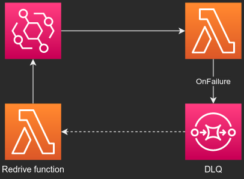
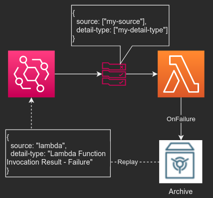
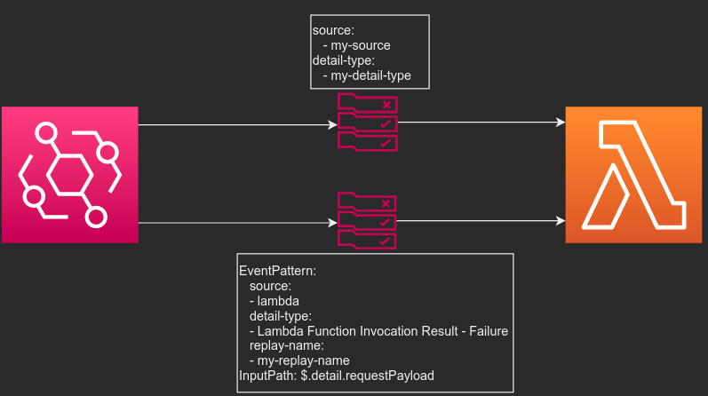
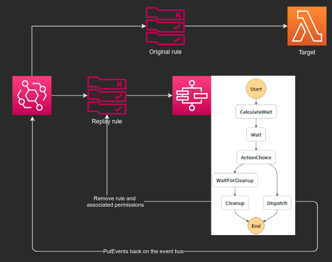

# Lambda Destinations + EventBridge Archive & Replay + evb-cli = :rocket:

In a pre-EventBridge time a common pub/sub pattern was SNS/SQS. We always added an SQS DLQ to our SQS->Lambda event sources, and when we wanted to redrive it, we could simply add it as a trigger to the original function. The schema of the messages would be the same and the Lambda handler would be able to parse the event.

With EventBridge we're given the power to transform the input the way we want it. The event doesn't follow the `$.Records[]`-format, which is great. However, the only durable DLQ choice for EventBridge would be an `OnFailure` destination to `SQS`. When we wanted to redrive messages, we needed an intermediary function that fetched the message body from the SQS record and passed it back on EventBridge:



## Using EventBridge as Lambda destination

Until EventBridge archives, passing failures to EventBridge meant that you had to have a rule consuming those events, or they'd get lost.

The event being put on the eventbus in the case of a function failure looks like this (with uninteresting fields removed):

```
{
  "detail-type": "Lambda Function Invocation Result - Failure",
  "source": "lambda",
  "resources": [
    "arn:aws:events:eu-west-1:123456789012:event-bus/myeventbus",
    "arn:aws:lambda:eu-west-1:123456789012:function:my-function:$LATEST"
  ],
  "detail": {
    "requestContext": {
      "functionArn": "arn:aws:lambda:eu-west-1:123456789012:function:my-function:$LATEST",
      "condition": "RetriesExhausted",
      "approximateInvokeCount": 1
    },
    "requestPayload": {
      "time": "2020-11-26T21:06:18Z",
      "City": "Bålsta",
      "UserId": "12345"
    },
    "responseContext": {
      "statusCode": 200,
      "executedVersion": "$LATEST",
      "functionError": "Unhandled"
    },
    "responsePayload": {
      "errorType": "Error",
      "errorMessage": "error!",
      "trace": [
        "Error: error!",
        "    at Runtime.exports.handler (/var/task/src/demoevent.js:6:15)",
        "    at Runtime.handleOnce (/var/runtime/Runtime.js:66:25)"
      ]
    }
  }
}
```

## Adding durability to the failed events
Using EventBridge Archives, we can easily create a swallow-all pattern per eventbus:
```
FailureArchive:
  Type: AWS::Events::Archive
  Properties:
    ArchiveName: !Sub ${MyEventBus}-errors
    EventPattern:
      source:
      - lambda
      detail-type:
      - Lambda Function Invocation Result - Failure
    RetentionDays: 10
    SourceArn:
      Fn::GetAtt:
      - MyEventBus
      - Arn
```

Now all you need to do to make your failed events durable is to add an `OnFailure` destination to your function. Note that this function could be triggered by any asynchronous event source.

## Replaying failed events
EventBridge replays lets you replay archived events between two datetimes against either all rules or specified ones. This works great if the archived events match the original event pattern and is suitable to recover from total downtime due to a dead third party service for example, but what if you have a mission critical target function that over the past 3 hours has handled 10 million invocations with a 1% error rate. then you don't want to rerun _all_ 10 million events only to reprocess the 100K faulty ones.

In this scenario we want to create a replay of _only the erroneous_ events. However when replaying from the `OnFailure`-archived events, the event body looks different and won't match the target rule's event pattern. What we want to invoke the function with is the `$.detail.requestPayload` object. This is the result of any input transformations made by the original target.


_Illustration of the event pattern mismatch_

What we need is another rule with the same target function, but with a different event pattern and input path:

The bottom pattern is the one needed to ingest a replay from the dead letter archive. However, since it's bound to a replay-name, we want it to only exist during the cours eof the replay


## Easy replays with evb-cli
evb-cli provides a solution for both simple replays of all events and replays of events sent to a Lambda OnFailure destination.

### Replays of all events
```
Usage: evb replay|r [options]

Starts a replay of events against a specific destination

Options:
  -b, --eventbus [eventbus]       The eventbus the archive is stored against (default: "default")
  -r, --rule-prefix [rulePrefix]  Rule name prefix
  -p, --profile [profile]         AWS profile to use
  -s, --replay-speed [speed]      The speed of the replay in % where 0 == all at once and 100 == real time speed
  -n, --replay-name [name]        The replay name (default: "evb-cli-replay-1606428653058")
  --region [region]               The AWS region to use. Falls back on AWS_REGION environment variable if not specified
  -h, --help                      output usage information
  ```


This will start a replay at the fastest possible speed of events between the datetimes you chose. Should you want to run the replay at a slower speed, then you can pass `--replay-speed` with a value between 1 and 100, where 100 is 100% of the original duration. For example, if you choose to replay 3 hours of events with 100% speed, then the replay will take 3 hours. If you choose 50, then it'll take 1.5 hours

### Replays of failed events
```
Usage: evb replay-dead-letter|rdl [options]

Starts a replay of events against a specific destination

Options:
  -n, --function-name [functionName]               Function name
  -p, --function-name-prefix [functionNamePrefix]  Function name prefix to speed up load
  --profile [profile]                              AWS profile to use
  -s, --replay-speed [speed]                       The speed of the replay in % where 0 == all at once and 100 == real time speed
  -n, --replay-name [name]                         The replay name (default: "evb-cli-replay-1606428700661")
  --region [region]                                The AWS region to use. Falls back on AWS_REGION environment variable if not specified
  -h, --help                                       output usage information
  ```

This works in a similar way to a normal replay, but it creates a temporary rule which is matching the replay and forwards the `$.detail.requestPayload` object.

When the replay is over this rule and associated permissions are removed.

## Paced replays
When adding `--replay-speed <1-100>`, the tool with create a new temporary rule wich is forwarding the replayed events to a StepFunctions state machine:

Steps:
* `CalculateWait`: Calculates the duration of the `Wait` state base don the length of the replay and the `--replay-speed` precentage.
* `Wait`: Wait state holding each event from dispatching based on the set replay speed
* `ActionChoice`: Either cleanup or dispatch. The cleanup execution is started first and finished last
* `CleanUp`: Removes all temporary resources created for the replay
* `Dispatch`: Re-puts the events on the event bus

*Note that the Step Functions flow will only happen when using `--replay-speed` > 0 or replaying from an OnFailure archive. Both require the [evb-local](https://serverlessrepo.aws.amazon.com/applications/eu-west-1/751354400372/evb-local) backend installed in your AWS account.

